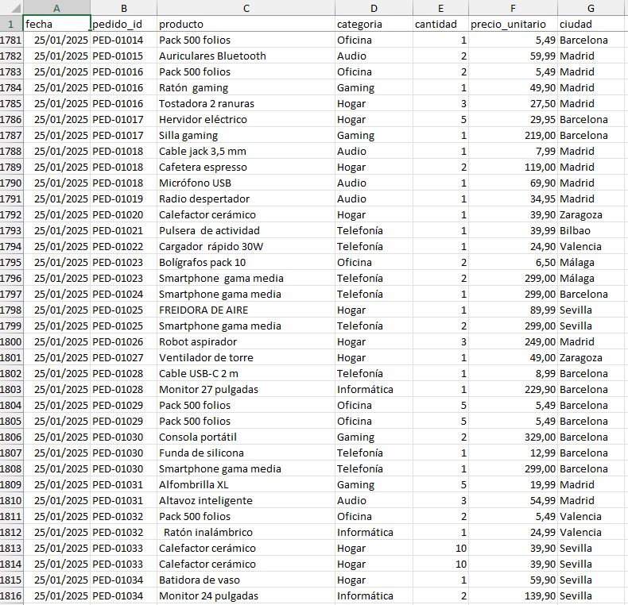
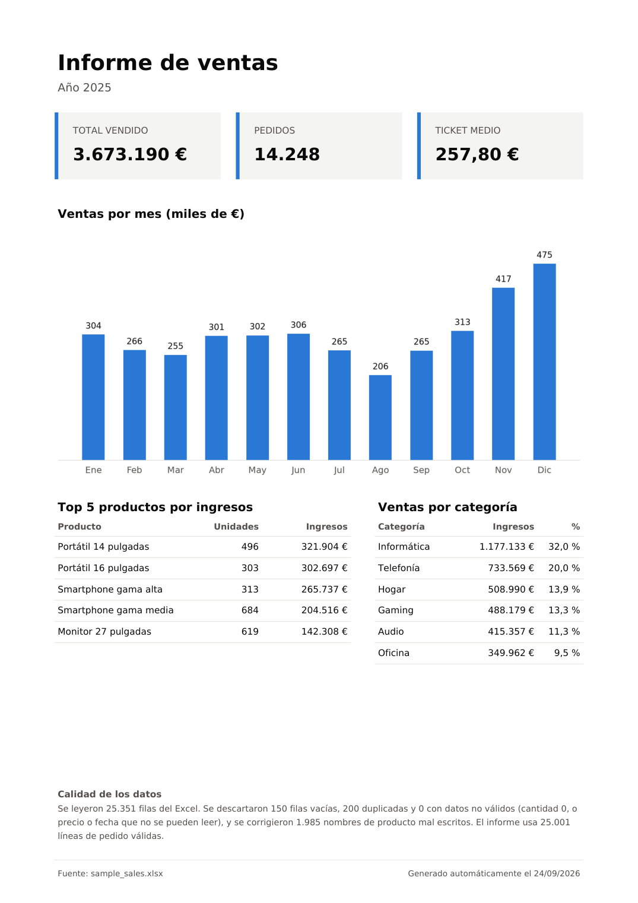

# Informe de ventas automático: de Excel a PDF

**Convierte tu Excel de ventas en un informe PDF listo para enviar, en segundos y sin tocarlo a mano.**

Sin errores de copiar y pegar. Y el informe sale igual cada vez que lo generas.

## Antes y después

| Antes: Excel en bruto (filas vacías, duplicados, nombres mal escritos) | Después: informe PDF de 1 página |
|---|---|
|  |  |

## Cómo usarlo (sin instalar nada)

Para usarlo en la oficina no hace falta saber programar ni instalar Python.

1. **Descarga** [`InformeVentas.exe`](https://github.com/manchadito09/reporte-ventas/releases/latest)
   y guárdalo donde quieras (por ejemplo, en el Escritorio).
2. **Arrastra tu Excel** de ventas encima de `InformeVentas.exe`.
   *(O haz doble clic en `InformeVentas.exe` y elige el Excel en la ventana.)*
3. Espera unos segundos. El informe se abre solo y se guarda **junto a tu Excel**
   con el mismo nombre terminado en `_informe.pdf`.

```
ventas 2025.xlsx  ──arrastrar──▶  InformeVentas.exe  ──▶  ventas 2025_informe.pdf
```

> **La primera vez**, Windows puede mostrar *"Windows protegió su PC"*.
> Es normal en programas pequeños que no son de una gran empresa.
> Pulsa **Más información** → **Ejecutar de todas formas**. Solo pasa una vez.

Tu Excel necesita estas columnas (en cualquier orden):
`fecha`, `pedido_id`, `producto`, `categoria`, `cantidad`, `precio_unitario`, `ciudad`.
Si falta alguna, el programa te dirá cuál.

Tus datos **no salen de tu ordenador**: todo se procesa en local.

## Qué hace

Lee un Excel de ventas (probado con 25.000 filas, unos 10 segundos) y genera un PDF con:

- **KPIs**: total vendido, número de pedidos y ticket medio
- **Gráfico**: ventas por mes
- **Top 5 productos** por ingresos
- **Ventas por categoría**, con su porcentaje
- **Nota de calidad**: cuántas filas se limpiaron y por qué

Antes de calcular nada, **limpia los datos**:

| Problema en el Excel | Qué hace el programa |
|---|---|
| Filas vacías | Las descarta |
| Filas duplicadas (copiar y pegar) | Las descarta |
| `"  PACK 500 FOLIOS "`, `"pack 500 folios"` | Las unifica en `"Pack 500 folios"` |
| Precios o cantidades escritos como texto (`22,90`, `22,90 €`, `1.234,56`) | Los entiende como números |
| Fechas en texto (`2025-01-05` o `05/01/2025`) | Las entiende sin confundir día y mes |
| Devoluciones (cantidad negativa) | Las **resta** del total y lo indica en el informe |
| Cabeceras con espacios o mayúsculas (`" Fecha "`, `PRODUCTO`), columnas extra o en otro orden | Las reconoce igual |
| Cantidad 0, precio vacío o ilegible, fecha rota | Descarta la fila |

Si el Excel no existe o le faltan columnas, lo avisa con un mensaje claro en español.
Y si tiene que descartar **más del 5 %** de las filas, el informe lo destaca en ámbar
(*"⚠ Revisa tu Excel..."*) para que nadie se fíe de un total incompleto.

El informe se adapta a los datos: nombres largos se recortan con `…`, más de 7 categorías
se agrupan en *"Otras"*, y si el periodo cruza de año los meses llevan el año (`Nov 24`, `Ene 25`).

## Para desarrolladores: instalación (Windows, PowerShell)

Necesitas [Python 3.10 o superior](https://www.python.org/downloads/).

```powershell
# 1. Descargar el proyecto
git clone https://github.com/manchadito09/reporte-ventas.git
cd reporte-ventas

# 2. Crear y activar un entorno virtual (una "caja" aislada para las librerías)
python -m venv .venv
.\.venv\Scripts\Activate.ps1

# 3. Instalar las librerías
pip install -r requirements.txt
```

> Si `Activate.ps1` da un error de permisos, ejecuta una vez
> `Set-ExecutionPolicy -Scope CurrentUser RemoteSigned` y vuelve a intentarlo.

## Uso

```powershell
# Generar el informe a partir del Excel de ejemplo
python generate_report.py data/sample_sales.xlsx --output output/report.pdf

# Abrirlo
start output\report.pdf
```

Para usar tu propio Excel, basta con que tenga estas columnas:

| fecha | pedido_id | producto | categoria | cantidad | precio_unitario | ciudad |
|---|---|---|---|---|---|---|

### Datos de ejemplo

`data/sample_sales.xlsx` contiene **datos inventados** (ninguna persona ni empresa real):
**un año completo (2025)** con unas 25.000 líneas de pedido, 14.000 pedidos y 60 productos en 6 categorías,
con temporada realista (rebajas, verano flojo, Black Friday, Navidad) y suciedad puesta a propósito.
Para volver a crearlo:

```powershell
python generate_data.py
```

Siempre sale idéntico (usa una semilla fija). Tarda unos 10 segundos.

### Excels de otras empresas (ficticias)

`data/empresas/` tiene 4 Excels de empresas **inventadas**, cada uno pensado para poner a prueba algo distinto:

| Archivo | Qué pone a prueba |
|---|---|
| `ropa_tienda.xlsx` | Periodo que cruza de año (nov 2024 – abr 2025) |
| `bebidas_distribuidora.xlsx` | Venta al por mayor, cifras de millones |
| `electronica_tienda.xlsx` | 15 categorías y nombres de producto muy largos |
| `oficina_excel_manual.xlsx` | Excel tecleado a mano: cabeceras raras, precios en texto, devoluciones |

```powershell
python generate_company_samples.py
```

## Tests

```powershell
pytest -v
```

21 tests comprueban la limpieza de datos (precios en texto, devoluciones, duplicados, fechas...), los cálculos (pedidos únicos, ticket medio, top 5, porcentajes...), la maquetación del PDF y el programa completo de principio a fin.

## Fabricar el ejecutable

```powershell
pip install -r requirements-dev.txt
.\build_exe.ps1
```

Crea `dist\InformeVentas.exe` (~55 MB, tarda un par de minutos). Lleva dentro Python,
las librerías y la fuente, así que funciona en cualquier Windows sin instalar nada.
El `.exe` no se guarda en git: se publica en las
[Releases](https://github.com/manchadito09/reporte-ventas/releases) de GitHub.

## Tecnologías

| Herramienta | Para qué |
|---|---|
| **Python 3** | Lenguaje del proyecto |
| **pandas** | Leer, limpiar y resumir los datos |
| **openpyxl** | Leer y escribir archivos `.xlsx` |
| **matplotlib** | Dibujar el gráfico |
| **fpdf2** | Montar el PDF |
| **pytest** | Tests automáticos |
| **tkinter** | Ventana para elegir el Excel y avisos (viene con Python) |
| **PyInstaller** | Empaquetar todo en un único `InformeVentas.exe` |
| **DejaVu Sans** | Fuente libre incluida en `fonts/` para mostrar `€` y tildes en el PDF |

## Estructura

```
reporte-ventas/
├── generate_report.py   # programa principal: Excel -> PDF
├── app.py               # entrada del .exe: arrastrar Excel / elegir archivo
├── build_exe.ps1        # fabrica InformeVentas.exe
├── generate_data.py     # crea el Excel de ejemplo con datos falsos
├── generate_company_samples.py  # crea los Excels de 4 empresas ficticias
├── data/                # Excel de ejemplo + data/empresas/
├── fonts/               # fuente DejaVu Sans + licencia
├── tests/               # tests con pytest
├── docs/                # imágenes del README
├── requirements.txt     # librerías para usar el programa
└── requirements-dev.txt # + PyInstaller, para fabricar el .exe
```

## Mejoras futuras

- Enviar el informe por email automáticamente
- Programar la ejecución (por ejemplo, cada lunes a las 8:00)
- Aceptar CSV y otros formatos además de `.xlsx`
- Firmar el `.exe` con un certificado para que Windows no muestre el aviso
- Filtros por ciudad o por rango de fechas
- Comparar con el periodo anterior (por ejemplo, +12 % frente al año anterior)

## Licencia de la fuente

DejaVu Sans se distribuye bajo su propia licencia libre: ver [`fonts/LICENSE_DEJAVU`](fonts/LICENSE_DEJAVU).
